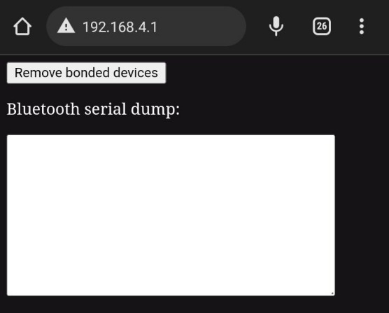

# WIFI_kit_32_dpf
Displays DPF status information on the WIFI_kit_32 or Wemos Lolin32 OLED device.

The device has only been tested with the Audi A4 B8 2.0 with CAGA engine and the iCar2 Vgate interface.

The premise of the project was to use an ESP32 module with an attached OLED display.

I found two solutions for my project: 

* WIFI_kit_32 
* WeMos Lolin32 OLED

The program is prepared for both boards.

I based my project on https://github.com/yangosoft/dpf

After launching, the device creates an AP with the address 192.168.4.1. This gives you the ability to view the communication, and remove the bluetooth devices bounded to the ESP32.

'Remove bonded devices' button comes in handy when we can't connect to the OBD interface.
Such a problem occurred when I connected to the interface with my phone and then wanted to connect with the device again.