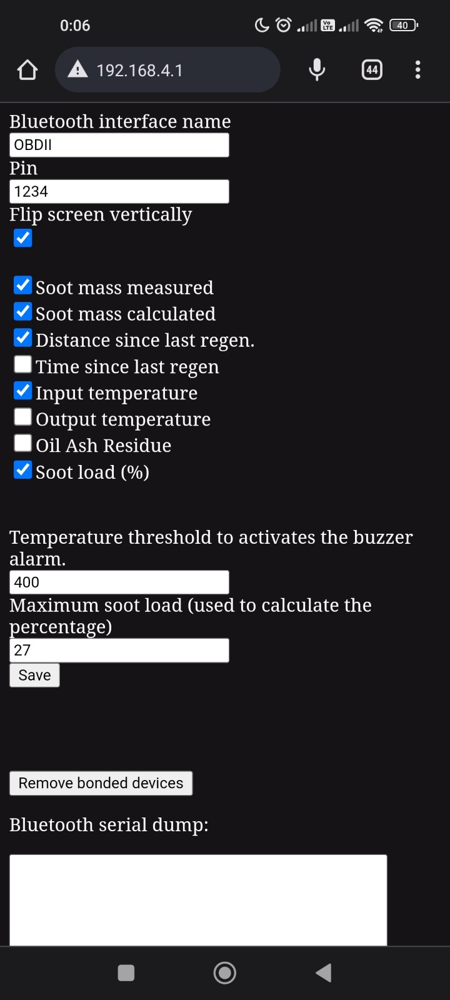

<div id="top"></div>

[![Contributors][contributors-shield]][contributors-url]
[![Forks][forks-shield]][forks-url]
[![Stargazers][stars-shield]][stars-url]
[![Issues][issues-shield]][issues-url]
[![MIT License][license-shield]][license-url]
[![LinkedIn][linkedin-shield]][linkedin-url]

<br />
<div align="center">

<h3 align="center">WIFI_kit_32_dpf</h3>

  <p align="center">
    Display DPF status on WIFI_kit_32 or Wemos Lolin32 OLED device.
    <br />
    <br />
    <a href="https://github.com/blizniukp/WIFI_kit_32_dpf/issues">Report Bug</a>
    ·
    <a href="https://github.com/blizniukp/WIFI_kit_32_dpf/issues">Request Feature</a>
  </p>
</div>

*Read this in other language: [English](README.md), [Polski](README.pl.md).*

<details>
  <summary>Table of Contents</summary>
  <ol>
    <li><a href="#about-the-project">About The Project</a></li>
    <li><a href="#supported-vehicles">Supported vehicles</a></li>
    <li><a href="#hardware">Hardware</a></li>
    <li><a href="#uploading-firmware-to-the-device">Uploading firmware to the device</a></li>
    <li><a href="#device-configuration">Device configuration</a></li>
    <li><a href="#roadmap">Roadmap</a></li>
    <li><a href="#license">License</a></li>
  </ol>
</details>

<!-- ABOUT THE PROJECT -->
## About The Project

The device connects to the OBD interface via Bluetooth and displays DPF status information.


The following parameters are displayed:

* Soot mass measured
* Soot mass calculated
* Distance since last regeneration
* Time since last regeneration
* Oil Ash Residue
* Input temperature
* Output temperature
* Soot load (%)


The data is refreshed every 5 seconds. On the right side of the display, a correct `V` or incorrect `X` reading of a given parameter is marked.
A progress bar is displayed at the bottom, counting down the time until the next parameter is checked.

Each of the readable parameters can be turned on or off.

I tested the device only with the iCar2 Vgate interface, but I suspect it could work with any interface with the ELM 327.

I based the project https://github.com/yangosoft/dpf

<p align="right">(<a href="#top">back to top</a>)</p>

## Supported vehicles

Below is a list with cars with which this device works (has been tested) or can work (needs to be tested).

|  Make  |  Model      |  Year  | Engine number | Soot mass measured | Soot mass calculated | Distance since last regen. | Time since last regen | Input temperature  | Output temperature | Oil Ash Residue    | Soot load (%)      |  Link         |
| ------ | ----------- | ------ | ------------- | ------------------ | -------------------- | -------------------------- | --------------------- | -----------------  | ------------------ | ---------------    | -------------      | ------------- |
|  Audi  |  A4 B8 2.0  |  2009  |     CAGA      | :heavy_check_mark: | :heavy_check_mark:   | :heavy_check_mark:         | :heavy_check_mark:    | :heavy_check_mark: | :heavy_check_mark: | :heavy_check_mark: | :heavy_check_mark: |     -         |
|  VW    |  Golf 7 1.6 |  2009  |     CLHA      | :white_check_mark: | :grey_question:      | :grey_question:            | :grey_question:       | :grey_question:    | :grey_question:    | :white_check_mark: | :white_check_mark: | https://forums.tdiclub.com/index.php?threads/reading-soot-level-with-torque.464119/page-5 |
|  VW    |  T6         |  2016  |     unknown   | :white_check_mark: | :white_check_mark:   | :white_check_mark:         | :white_check_mark:    | :white_check_mark: | :white_check_mark: | :white_check_mark: | :white_check_mark: | https://www.t6forum.com/threads/vw-t6-custom-pid-codes-for-dpf.33964/ |

:heavy_check_mark: - Tested + works
:white_check_mark: - Not tested but should work
:grey_question: - Not tested
:heavy_multiplication_x: - Not working

<p align="right">(<a href="#top">back to top</a>)</p>

## Hardware

The project was to be as uncomplicated as possible, so I was looking for a board with an ESP32 module with the display already built in.

I found two solutions for my project:
* WIFI_kit_32 
* WeMos Lolin32 OLED

The program is prepared for both versions.

The board selection is made in the `platformio.ini` file by leaving one of the options uncommented:

```
-DWIFI_KIT_32_BOARD
;-DWEMOS_BOARD
```

Optionally, you can add a buzzer (with a generator) that informs you when:
- the DPF regeneration starts and stops
- after exceeding 80% filter fill

The buzzer should be connected between the GND and D12 pins.


<p align="right">(<a href="#top">back to top</a>)</p>

## Uploading firmware to the device

The firmware can be uploaded using the application [Esp Download Tool](https://www.espressif.com/en/support/download/other-tools)


The latest firmware version is available in [Releases](https://github.com/blizniukp/WIFI_kit_32_dpf/releases)


We should have four files in the firmware package:
- bootloader_dio_40m.bin
- partitions.bin
- boot_app0.bin
- firmware.bin

You should extract them to some directory on your disk.

After launching the `ESP32 DOWNLOAD TOOL` application, you need to point to these files and complete the fields analogously to the screenshot below.


```
bootloader_dio_40m.bin - 0x1000
partitions.bin - 0x8000
boot_app0.bin - 0xe000
firmware.bin - 0x10000
```

Press the `Start` button to start uploading the firmware to the device.

<p align="right">(<a href="#top">back to top</a>)</p>


## Device configuration

The device has no configuration option yet.

When the device starts up, a WiFi hotspot is created with the following name and password:

SSID: `WIFI_kit_32_dpf`

Password: `wifikit32`

After connecting and accessing the 192.168.4.1 address, we have the ability to preview communication and remove paired devices.




The 'Remove bonded devices' button starts the procedure for removing paired Bluetooth devices on the ESP32 module.
This is useful when a connection error occurs. And the problem occurs when you connect to the OBD interface from your phone, and then want to connect again using the device.

The `Temperature threshold to activates the buzzer alarm` field is active only when the `Input temperature` reading option is selected.
The default value is 420. The hysteresis is 10°C. Thus, the buzzer will turn on when the input temperature exceeds 410°C, and turn off when the input temperature decreases below 390°C.

The `Maximum soot load (used to calculate the percentage)` field is active only when the `Soot load (%)` option is checked. The default value is 80% full. The hysteresis is 1%.
The buzzer alarm is triggered when the filter exceeds 79% full and is played only once.

<p align="right">(<a href="#top">back to top</a>)</p>

## Roadmap

- [x] Increase the font and display only one parameter at a time
- [x] Ability to configure the device (specifying the name of the OBD interface and PIN code)
- [x] Update the screenshot from ESP32 DOWNLOAD TOOL (I'm using Linux, and this app is for Windows)
- [x] Alarm (buzzer) when DPF regeneration begins and ends
- [ ] Automatic removal of paired devices in case of connection error
- [x] Save configurations to memory
- [x] Changing the display orientation

<p align="right">(<a href="#top">back to top</a>)</p>

## License

Distributed under the MIT License. 

See [LICENSE](LICENSE) for more information.

<p align="right">(<a href="#top">back to top</a>)</p>


<!-- MARKDOWN LINKS & IMAGES -->
<!-- https://www.markdownguide.org/basic-syntax/#reference-style-links -->
[contributors-shield]: https://img.shields.io/github/contributors/blizniukp/WIFI_kit_32_dpf.svg?style=for-the-badge
[contributors-url]: https://github.com/blizniukp/WIFI_kit_32_dpf/graphs/contributors
[forks-shield]: https://img.shields.io/github/forks/blizniukp/WIFI_kit_32_dpf.svg?style=for-the-badge
[forks-url]: https://github.com/blizniukp/WIFI_kit_32_dpf/network/members
[stars-shield]: https://img.shields.io/github/stars/blizniukp/WIFI_kit_32_dpf.svg?style=for-the-badge
[stars-url]: https://github.com/blizniukp/WIFI_kit_32_dpf/stargazers
[issues-shield]: https://img.shields.io/github/issues/blizniukp/WIFI_kit_32_dpf.svg?style=for-the-badge
[issues-url]: https://github.com/blizniukp/WIFI_kit_32_dpf/issues
[license-shield]: https://img.shields.io/github/license/blizniukp/WIFI_kit_32_dpf.svg?style=for-the-badge
[license-url]: https://github.com/blizniukp/WIFI_kit_32_dpf/blob/master/LICENSE
[linkedin-shield]: https://img.shields.io/badge/-LinkedIn-black.svg?style=for-the-badge&logo=linkedin&colorB=555
[linkedin-url]: https://linkedin.com/in/paweł-bliźniuk-433535183
[product-screenshot]: images/screenshot.png
